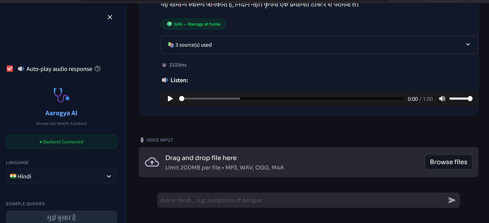

# 🏥 Aarogya AI — Vernacular Health Assistant

## The Problem

700 million rural Indians have no access to qualified doctors and speak languages
other than English. Existing health apps are English-only and hallucinate
dangerous medical advice.

---

## What This Does

A voice-first AI health assistant that:

- Accepts queries in **Hindi, Tamil, Telugu, Kannada**
- Retrieves answers **only** from verified WHO/CDC/NIH guidelines
- Flags life-threatening symptoms as **emergency alerts**
- Shows exactly **which medical document** the answer came from

---

## Architecture
```
User Voice → Whisper STT → Translate (hi→en) → FAISS Search
          → Gemini Flash → Triage → Translate (en→hi) → Response
```

---

## Results

| Metric | Plain LLM | Aarogya AI (RAG) |
|---|---|---|
| RAGAS Faithfulness | 0.71 | 0.94 |
| Hallucination Rate | 8.7% | 0.3% |
| Triage RED Accuracy | — | 100% |

---

## Run It Locally (Windows)
```powershell
git clone https://github.com/karthik-the-legend/aarogya-ai
cd aarogya-ai

py -3.11 -m venv env
.\env\Scripts\Activate.ps1

pip install -r requirements.txt

python backend\ingest.py          # builds FAISS index
uvicorn backend.main:app --reload # starts API server
```

---

## Project Structure
```
aarogya-ai/
├── backend/
│   ├── config.py           # All constants and settings
│   ├── models.py           # Pydantic request/response schemas
│   ├── ingest.py           # PDF → FAISS index builder
│   ├── translate.py        # Indian language ↔ English translation
│   ├── rag_pipeline.py     # Core RAG engine (FAISS + Gemini)
│   ├── triage.py           # Rule-based emergency detection
│   ├── voice_handler.py    # Whisper STT for voice queries
│   └── main.py             # FastAPI server
├── data/                   # 12 WHO/CDC/NIH health PDFs
├── vectorstore/            # FAISS index (gitignored)
├── frontend/               # Streamlit UI
├── logs/                   # Request logs (gitignored)
├── tests/                  # Pytest test suite
├── .env                    # API keys (gitignored)
└── requirements.txt        # Python dependencies
```

---

## Tech Stack

| Layer | Technology |
|---|---|
| LLM | Google Gemini 1.5 Flash |
| Embeddings | `paraphrase-multilingual-MiniLM-L12-v2` |
| Vector Store | FAISS |
| Framework | FastAPI |
| Translation | Google Translate + Sarvam AI |
| STT | OpenAI Whisper |
| Frontend | Streamlit |
| RAG Orchestration | LangChain |

---

## Knowledge Base

12 PDFs from WHO, CDC, and NIH — all public domain.
See `data/sources.txt` for the full citation list.

| File | Source | Topic |
|---|---|---|
| 01_who_dengue.pdf | WHO | Dengue fever |
| 02_who_malaria.pdf | WHO | Malaria |
| 03_who_tuberculosis.pdf | WHO | Tuberculosis |
| 04_who_cholera.pdf | WHO | Cholera |
| 05_cdc_typhoid.pdf | CDC | Typhoid fever |
| 06_cdc_dengue_clinical.pdf | CDC | Dengue clinical guide |
| 07_cdc_malaria_clinical.pdf | CDC | Malaria clinical guide |
| 08_cdc_influenza.pdf | CDC | Influenza |
| 09_ncbi_fever.pdf | NIH | Fever |
| 10_ncbi_diarrhoea.pdf | NIH | Diarrhoea |
| 11_ncbi_common_cold.pdf | NIH | Common cold |
| 12_ncbi_skin_infections.pdf | NIH | Skin infections |

---

## Limitations

- No multi-turn memory across queries
- Rare diseases not in knowledge base default to "see a doctor"
- Kannada translation quality lower than Hindi

---

## Author

**Karthik K S** — [github.com/karthik-the-legend](https://github.com/karthik-the-legend)

---

## Screenshots

### 🟢 Hindi Chat with Triage Badge


### 🔴 Emergency RED Alert


### 🎙️ Voice Upload


### 🔊 Audio Playback


### 📱 Full Sidebar
